# Rapport Genie Logiciel - TeamSync

## Sujet

**TeamSync** est une application web de gestion collaborative de projets, de workspaces, de taches, de calendriers, d'analytics, de notifications et de rapports. Ce rapport est prepare pour une presentation de **genie logiciel**. Il met principalement l'accent sur les **design patterns GoF** utilises dans le projet, leur role, les problemes qu'ils resolvent, leur integration dans le code, et les diagrammes de classes correspondants.

Le projet contient une implementation academique et pratique des design patterns dans le backend Java/Spring Boot. Les patterns sont places dans le package :

```text
src/main/java/com/teamsync/patterns/
```

Ils sont exposes via l'endpoint public :

```http
GET /patterns
```

Cet endpoint retourne le catalogue des patterns implementes, leurs categories, leurs packages, leurs classes principales et leur objectif.

---

## Table des matieres

1. Presentation generale du projet
2. Objectifs fonctionnels de TeamSync
3. Architecture logicielle globale
4. Technologies utilisees
5. Modele de domaine
6. Design patterns utilises
7. Patterns de creation
8. Patterns structurels
9. Patterns comportementaux
10. Synthese des patterns par probleme resolu
11. Qualite logicielle et principes SOLID
12. Exemples de flux metier
13. Conclusion

---

# 1. Presentation generale du projet

TeamSync est une plateforme de collaboration equipe/projet. Elle permet a un utilisateur de creer des workspaces, d'ajouter des membres, de creer des projets, de suivre des taches, de commenter, de consulter le calendrier, de suivre l'activite et de generer des rapports.

L'application est composee de deux grandes parties :

- **Backend Spring Boot** : REST API, securite JWT, logique metier, persistence PostgreSQL, patterns GoF.
- **Frontend Angular** : interface utilisateur moderne, pages dashboard/workspaces/projects/tasks/calendar/analytics/settings/patterns, appels HTTP via services Angular.

L'objectif pedagogique principal du projet est de montrer comment des design patterns classiques peuvent etre appliques dans un vrai systeme logiciel au lieu d'etre seulement presentes comme des exemples abstraits.

## 1.1 Ce que fait TeamSync

TeamSync sert a organiser le travail d'une equipe autour de plusieurs concepts :

- Un **workspace** regroupe des utilisateurs et des projets.
- Un **projet** appartient a un workspace et possede un manager, un statut, une deadline et un niveau de progression.
- Une **tache** appartient a un projet et possede un statut, une priorite, une date limite, un assignee et des sous-taches.
- Les **commentaires** permettent la collaboration autour d'une tache.
- Les **notifications** signalent les changements importants.
- Les **activity logs** enregistrent l'historique metier.
- Les **analytics** donnent une vision sur la performance projet.
- Les **rapports** exportent les donnees au format JSON, CSV ou PDF.

---

# 2. Objectifs fonctionnels

TeamSync permet notamment :

- La creation et la gestion des comptes utilisateurs.
- L'authentification par JWT.
- La gestion des roles : `ADMIN`, `PROJECT_MANAGER`, `TEAM_MEMBER`.
- La creation et modification de workspaces.
- L'ajout et la suppression de membres dans un workspace.
- La creation, mise a jour, archivage et favoris des projets.
- La creation, assignation, changement de statut et suppression de taches.
- La gestion des sous-taches.
- Les commentaires et reponses aux commentaires.
- Le calendrier des deadlines de taches/projets.
- Les analytics et rapports de projets.
- Les notifications in-app et email simulees.
- Le catalogue academique des design patterns.

---

# 3. Architecture logicielle globale

Le backend suit une architecture en couches claire :

```text
com.teamsync
├── presentation
│   ├── controller     # REST controllers : routage HTTP uniquement
│   └── dto            # Objets de transfert Request/Response
├── service            # Logique metier
├── repository         # Interfaces Spring Data JPA
├── domain
│   ├── entity         # Entites JPA
│   └── enums          # Enumerations metier
├── infrastructure
│   ├── security       # JWT, filtres, config Spring Security
│   ├── config         # Configuration OpenAPI
│   └── exception      # Exceptions personnalisees
└── patterns           # Design patterns GoF
    ├── creational
    ├── structural
    └── behavioral
```

## 3.1 Diagramme d'architecture generale

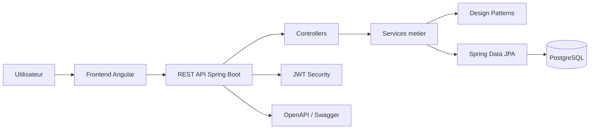
```mermaid
flowchart LR
    U[Utilisateur] --> UI[Frontend Angular]
    UI --> API[REST API Spring Boot]
    API --> Controllers[Controllers]
    Controllers --> Services[Services metier]
    Services --> Patterns[Design Patterns]
    Services --> Repositories[Spring Data JPA]
    Repositories --> DB[(PostgreSQL)]
    API --> Security[JWT Security]
    API --> Swagger[OpenAPI / Swagger]
```

## 3.2 Principe de separation des responsabilites

- Les **controllers** ne contiennent pas la logique metier lourde.
- Les **services** orchestrent les operations metier.
- Les **repositories** isolent l'acces aux donnees.
- Les **DTOs** evitent d'exposer directement les entites JPA.
- Les **patterns** encapsulent des problemes recurrents : creation, validation, changement d'etat, undo, notification, export, autorisation, etc.

---

# 4. Technologies utilisees

## 4.1 Backend

| Technologie | Role |
|---|---|
| Java 17 | Langage principal backend |
| Spring Boot 3.3.5 | Framework backend REST |
| Spring Web | Exposition des endpoints REST |
| Spring Data JPA | Abstraction de persistence |
| Hibernate | ORM utilise par JPA |
| PostgreSQL | Base de donnees relationnelle |
| Spring Security | Securite applicative |
| JWT / JJWT | Authentification stateless par token |
| Bean Validation | Validation des DTOs |
| Lombok | Reduction du boilerplate Java |
| SpringDoc OpenAPI | Documentation Swagger |
| Maven | Build et gestion des dependances |

## 4.2 Frontend

| Technologie | Role |
|---|---|
| Angular 21 | Framework frontend |
| TypeScript | Langage frontend type |
| RxJS | Programmation reactive et Observables |
| Angular Router | Navigation entre pages |
| Angular Forms | Formulaires et bindings |
| Chart.js / ng2-charts | Graphiques analytics |
| ngx-toastr | Notifications UI |
| SCSS/CSS variables | Theming et style |
| Angular build | Compilation frontend |

---

# 5. Modele de domaine

| Entite | Description |
|---|---|
| `User` | Utilisateur authentifie avec role, email, password hash |
| `Workspace` | Espace de collaboration contenant membres et projets |
| `Project` | Projet avec statut, deadline, progress, manager |
| `Task` | Tache avec statut, priorite, assignee, dependances |
| `Subtask` | Sous-tache rattachee a une tache |
| `Comment` | Commentaire ou reponse sur une tache |
| `Notification` | Notification in-app ou email |
| `ActivityLog` | Historique d'activite |
| `ProjectFavorite` | Favori projet par utilisateur |
| `UserPreference` | Preferences utilisateur |

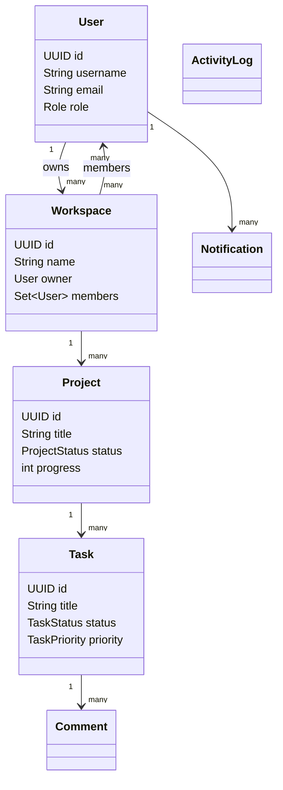
```mermaid
classDiagram
    class User {
      UUID id
      String username
      String email
      Role role
    }
    class Workspace {
      UUID id
      String name
      User owner
      Set~User~ members
    }
    class Project {
      UUID id
      String title
      ProjectStatus status
      int progress
    }
    class Task {
      UUID id
      String title
      TaskStatus status
      TaskPriority priority
    }
    class Comment
    class Notification
    class ActivityLog

    User "1" --> "many" Workspace : owns
    Workspace "many" --> "many" User : members
    Workspace "1" --> "many" Project
    Project "1" --> "many" Task
    Task "1" --> "many" Comment
    User "1" --> "many" Notification
```

---

# 6. Vue globale des design patterns

Le projet implemente les **14 patterns GoF** suivants :

| ID | Pattern | Categorie | Package |
|---|---|---|---|
| 1 | Singleton | Creation | `patterns.creational.singleton` |
| 2 | Factory Method | Creation | `patterns.creational.factory` |
| 3 | Builder | Creation | `patterns.creational.builder` |
| 4 | Prototype | Creation | `patterns.creational.prototype` |
| 5 | Facade | Structurel | `patterns.structural.facade` |
| 6 | Adapter | Structurel | `patterns.structural.adapter` |
| 7 | Proxy | Structurel | `patterns.structural.proxy` |
| 8 | Decorator | Structurel | `patterns.structural.decorator` |
| 9 | Observer | Comportemental | `patterns.behavioral.observer` |
| 10 | Strategy | Comportemental | `patterns.behavioral.strategy` |
| 11 | State | Comportemental | `patterns.behavioral.state` |
| 12 | Command | Comportemental | `patterns.behavioral.command` |
| 13 | Chain of Responsibility | Comportemental | `patterns.behavioral.chain` |
| 14 | Template Method | Comportemental | `patterns.behavioral.template` |

---

# 7. Patterns de creation

## 7.1 Singleton - `AppLogger`

### Probleme

L'application a besoin d'un mecanisme centralise pour logger des evenements metier. Sans Singleton, chaque service pourrait creer sa propre instance de logger, ce qui cause une configuration incoherente et du code duplique.

### Solution

Le pattern **Singleton** garantit qu'une seule instance de `AppLogger` est utilisee dans l'application.

### Diagramme de classes

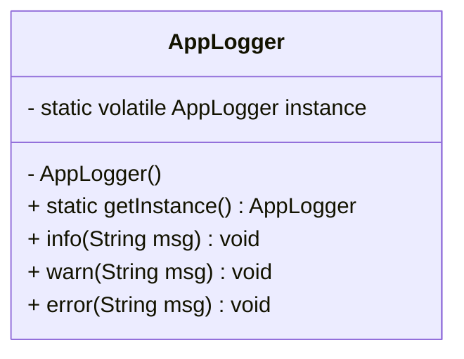
```mermaid
classDiagram
    class AppLogger {
      - static volatile AppLogger instance
      - AppLogger()
      + static getInstance() AppLogger
      + info(String msg) void
      + warn(String msg) void
      + error(String msg) void
    }
```

### Code essentiel

```java
public class AppLogger {
    private static volatile AppLogger instance;
    private AppLogger() {}

    public static AppLogger getInstance() {
        if (instance == null) {
            synchronized (AppLogger.class) {
                if (instance == null) {
                    instance = new AppLogger();
                }
            }
        }
        return instance;
    }
}
```

### Probleme resolu dans TeamSync

Quand un workspace ou projet est cree, le service peut appeler :

```java
AppLogger.getInstance().info("Workspace created: " + workspace.getName());
```

### Avantages

- Instance unique.
- Acces global controle.
- Implementation thread-safe avec double-checked locking.
- Simple a utiliser dans les services.

---

## 7.2 Factory Method - Notifications

### Probleme

TeamSync supporte plusieurs types de notifications : in-app et email. Si le service creait directement chaque notification, il serait couple aux details de construction.

### Solution

Le pattern **Factory Method** definit une classe abstraite `NotificationFactory`. Les sous-classes creent le type concret de notification.

### Diagramme de classes

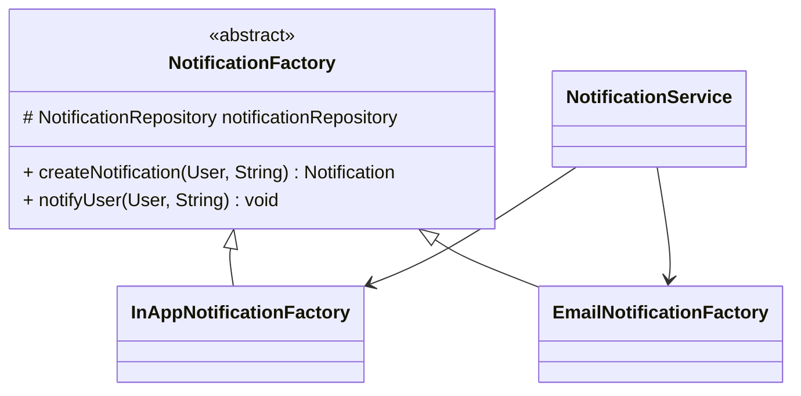
```mermaid
classDiagram
    class NotificationFactory {
      <<abstract>>
      # NotificationRepository notificationRepository
      + createNotification(User, String) Notification
      + notifyUser(User, String) void
    }
    class InAppNotificationFactory
    class EmailNotificationFactory
    class NotificationService
    NotificationFactory <|-- InAppNotificationFactory
    NotificationFactory <|-- EmailNotificationFactory
    NotificationService --> InAppNotificationFactory
    NotificationService --> EmailNotificationFactory
```

### Code essentiel

```java
public abstract class NotificationFactory {
    protected final NotificationRepository notificationRepository;

    public abstract Notification createNotification(User recipient, String message);

    public final void notifyUser(User recipient, String message) {
        Notification notification = createNotification(recipient, message);
        notificationRepository.save(notification);
    }
}
```

Utilisation :

```java
public void notify(User recipient, String message, NotificationType type) {
    if (type == NotificationType.EMAIL) {
        emailFactory.notifyUser(recipient, message);
    } else {
        inAppFactory.notifyUser(recipient, message);
    }
}
```

### Avantages

- Creation centralisee.
- Service decouple du constructeur concret.
- Ajout facile d'un nouveau canal.

---

## 7.3 Builder - Reports

### Probleme

Un rapport peut contenir plusieurs champs optionnels : projet, format, sections, periode. Un constructeur long serait difficile a lire.

### Solution

Le pattern **Builder** permet de construire un `Report` etape par etape via une API fluide.

### Diagramme de classes

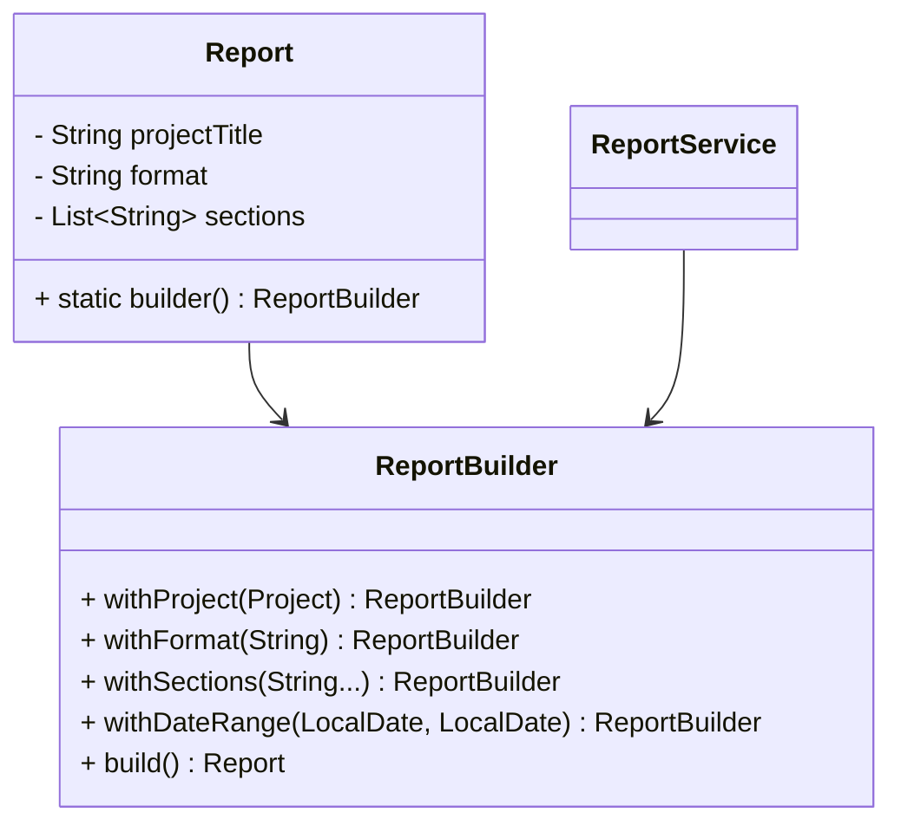
```mermaid
classDiagram
    class Report {
      - String projectTitle
      - String format
      - List~String~ sections
      + static builder() ReportBuilder
    }
    class ReportBuilder {
      + withProject(Project) ReportBuilder
      + withFormat(String) ReportBuilder
      + withSections(String...) ReportBuilder
      + withDateRange(LocalDate, LocalDate) ReportBuilder
      + build() Report
    }
    Report --> ReportBuilder
    ReportService --> ReportBuilder
```

### Code essentiel

```java
Report report = Report.builder()
        .withProject(project)
        .withFormat(normalizedFormat)
        .withSections("stats", "workload", "health")
        .withDateRange(LocalDate.now().minusMonths(1), LocalDate.now())
        .build();
```

```java
public Report build() {
    if (projectTitle == null || projectTitle.isBlank()) {
        throw new IllegalStateException("Project title is required");
    }
    if (format == null || format.isBlank()) {
        throw new IllegalStateException("Format is required");
    }
    return new Report(this);
}
```

### Avantages

- Code lisible.
- Validation finale au moment de `build()`.
- Ajout facile de nouveaux champs.

---

## 7.4 Prototype - Task Templates

### Probleme

Les utilisateurs recreent souvent des taches similaires. Sans template, ils doivent ressaisir les memes informations.

### Solution

Le pattern **Prototype** permet de cloner un modele de tache pour creer une nouvelle tache pre-remplie.

### Diagramme de classes

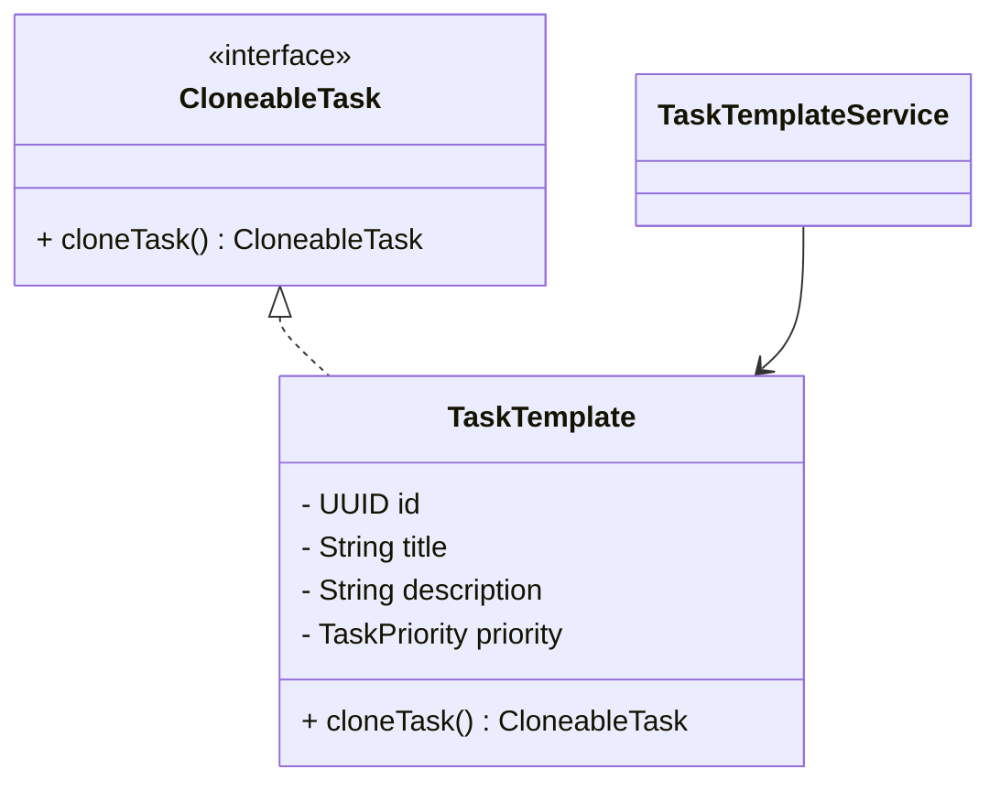
```mermaid
classDiagram
    class CloneableTask {
      <<interface>>
      + cloneTask() CloneableTask
    }
    class TaskTemplate {
      - UUID id
      - String title
      - String description
      - TaskPriority priority
      + cloneTask() CloneableTask
    }
    class TaskTemplateService
    CloneableTask <|.. TaskTemplate
    TaskTemplateService --> TaskTemplate
```

### Code essentiel

```java
public interface CloneableTask {
    CloneableTask cloneTask();
}
```

Exemple conceptuel :

```java
TaskTemplate template = templateRepository.findById(templateId).orElseThrow();
TaskTemplate copy = (TaskTemplate) template.cloneTask();
```

### Avantages

- Reduit la repetition.
- Creation rapide a partir de modeles.
- Decouple la creation de la tache de sa source originale.

---
# 8. Patterns structurels

Les patterns structurels organisent la composition des classes et objets. Dans TeamSync, ils simplifient les appels complexes, adaptent des interfaces, protegent des operations et enrichissent dynamiquement des notifications.

---

## 8.1 Facade - `ProjectManagementFacade`

### Probleme

Initialiser un projet demande plusieurs operations : verifier le workspace, recuperer le manager, construire un DTO, creer le projet et logger l'action. Si le controller faisait tout cela, il deviendrait lourd et couple aux services internes.

### Solution

Le pattern **Facade** fournit une interface simple :

```java
initializeProject(workspaceId, projectTitle, managerEmail)
```

### Diagramme de classes

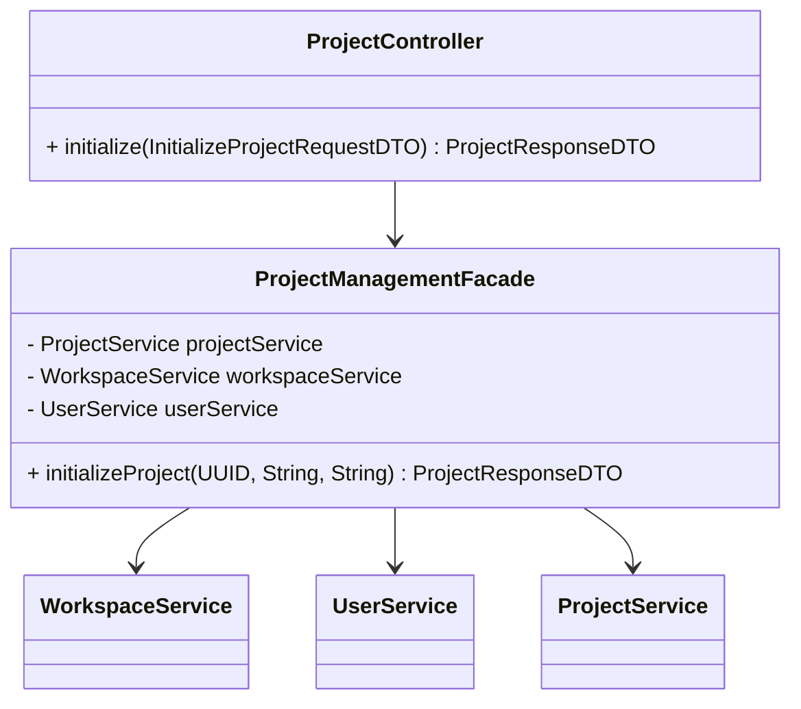
```mermaid
classDiagram
    class ProjectController {
      + initialize(InitializeProjectRequestDTO) ProjectResponseDTO
    }
    class ProjectManagementFacade {
      - ProjectService projectService
      - WorkspaceService workspaceService
      - UserService userService
      + initializeProject(UUID, String, String) ProjectResponseDTO
    }
    class WorkspaceService
    class UserService
    class ProjectService
    ProjectController --> ProjectManagementFacade
    ProjectManagementFacade --> WorkspaceService
    ProjectManagementFacade --> UserService
    ProjectManagementFacade --> ProjectService
```

### Code essentiel

```java
@Component
public class ProjectManagementFacade {
    public ProjectResponseDTO initializeProject(UUID workspaceId,
                                                String projectTitle,
                                                String managerEmail) {
        workspaceService.getWorkspace(workspaceId);
        User manager = userService.findByEmail(managerEmail);

        ProjectRequestDTO request = new ProjectRequestDTO();
        request.setTitle(projectTitle);
        request.setManagerId(manager.getId());

        ProjectResponseDTO dto = projectService.create(workspaceId, request);
        AppLogger.getInstance().info("Project initialized via facade: " + projectTitle);
        return dto;
    }
}
```

### Probleme resolu dans TeamSync

Le controller expose un endpoint simple :

```java
@PostMapping("/projects/initialize")
public ProjectResponseDTO initialize(@Valid @RequestBody InitializeProjectRequestDTO request) {
    return projectManagementFacade.initializeProject(
        request.getWorkspaceId(),
        request.getProjectTitle(),
        request.getManagerEmail()
    );
}
```

### Avantages

- Interface simple pour un flux complexe.
- Controller plus propre.
- Orchestration centralisee.
- Moins de couplage.

---

## 8.2 Adapter - `EmailServiceAdapter`

### Probleme

TeamSync veut utiliser une interface interne `EmailService.sendEmail(to, subject, body)`, mais le client externe simule propose `sendMessage(to, message)`.

### Solution

Le pattern **Adapter** convertit l'interface externe vers l'interface attendue par l'application.

### Diagramme de classes

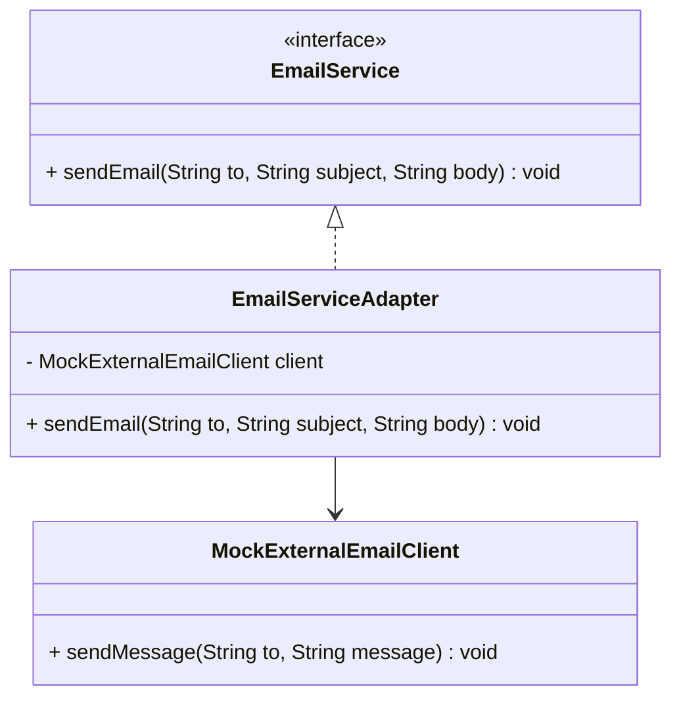
```mermaid
classDiagram
    class EmailService {
      <<interface>>
      + sendEmail(String to, String subject, String body) void
    }
    class MockExternalEmailClient {
      + sendMessage(String to, String message) void
    }
    class EmailServiceAdapter {
      - MockExternalEmailClient client
      + sendEmail(String to, String subject, String body) void
    }
    EmailService <|.. EmailServiceAdapter
    EmailServiceAdapter --> MockExternalEmailClient
```

### Code essentiel

```java
@Component
public class EmailServiceAdapter implements EmailService {
    private final MockExternalEmailClient client = new MockExternalEmailClient();

    @Override
    public void sendEmail(String to, String subject, String body) {
        client.sendMessage(to, subject + " | " + body);
    }
}
```

### Probleme resolu dans TeamSync

Le reste de l'application depend de `EmailService`, pas du client externe. On peut remplacer `MockExternalEmailClient` par SendGrid, Mailgun ou SMTP sans changer les services.

---

## 8.3 Proxy - `TaskServiceProxy`

### Probleme

Certaines operations de taches sont sensibles : supprimer une tache doit etre reserve a `ADMIN` ou `PROJECT_MANAGER`, et assigner une tache doit etre reserve aux membres du projet/workspace.

### Solution

Le pattern **Proxy** intercepte les appels au service de taches et ajoute des controles avant de deleguer au vrai service.

### Diagramme de classes

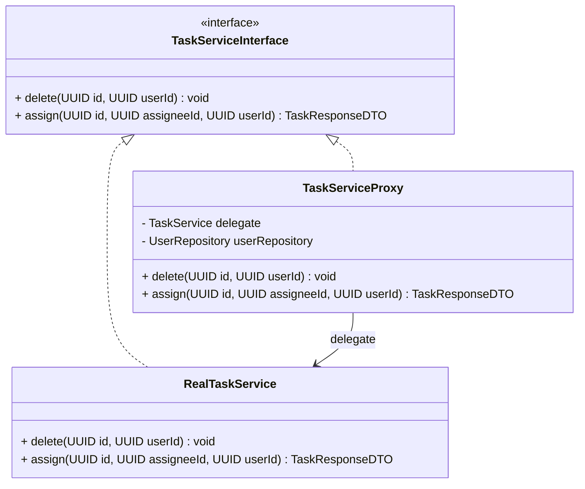
```mermaid
classDiagram
    class TaskServiceInterface {
      <<interface>>
      + delete(UUID id, UUID userId) void
      + assign(UUID id, UUID assigneeId, UUID userId) TaskResponseDTO
    }
    class RealTaskService {
      + delete(UUID id, UUID userId) void
      + assign(UUID id, UUID assigneeId, UUID userId) TaskResponseDTO
    }
    class TaskServiceProxy {
      - TaskService delegate
      - UserRepository userRepository
      + delete(UUID id, UUID userId) void
      + assign(UUID id, UUID assigneeId, UUID userId) TaskResponseDTO
    }
    TaskServiceInterface <|.. RealTaskService
    TaskServiceInterface <|.. TaskServiceProxy
    TaskServiceProxy --> RealTaskService : delegate
```

### Code essentiel

```java
@Primary
@Service
public class TaskServiceProxy implements TaskService {
    private final TaskService delegate;
    private final UserRepository userRepository;

    @Override
    public void delete(UUID id, UUID userId) {
        User caller = getUser(userId);
        if (caller.getRole() != Role.ADMIN && caller.getRole() != Role.PROJECT_MANAGER) {
            throw new AccessDeniedException("Only ADMIN or PROJECT_MANAGER can delete tasks");
        }
        delegate.delete(id, userId);
    }
}
```

### Probleme resolu dans TeamSync

Le proxy protege les operations sensibles sans melanger la logique de securite avec la logique principale de `TaskService`.

---

## 8.4 Decorator - Notifications urgentes et email

### Probleme

Une notification peut etre envoyee seulement in-app, in-app + email, ou avec un prefixe urgent. Creer une classe pour chaque combinaison causerait une explosion de classes.

### Solution

Le pattern **Decorator** ajoute dynamiquement des comportements autour d'un sender de base.

### Diagramme de classes

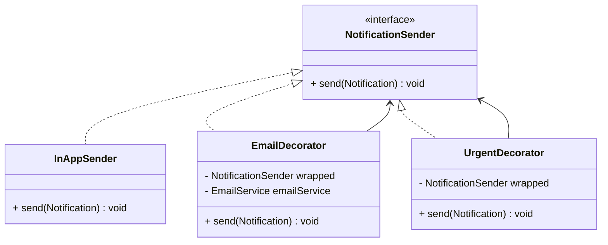
```mermaid
classDiagram
    class NotificationSender {
      <<interface>>
      + send(Notification) void
    }
    class InAppSender {
      + send(Notification) void
    }
    class EmailDecorator {
      - NotificationSender wrapped
      - EmailService emailService
      + send(Notification) void
    }
    class UrgentDecorator {
      - NotificationSender wrapped
      + send(Notification) void
    }
    NotificationSender <|.. InAppSender
    NotificationSender <|.. EmailDecorator
    NotificationSender <|.. UrgentDecorator
    EmailDecorator --> NotificationSender
    UrgentDecorator --> NotificationSender
```

### Code essentiel

```java
public class UrgentDecorator implements NotificationSender {
    private final NotificationSender wrapped;

    public UrgentDecorator(NotificationSender wrapped) {
        this.wrapped = wrapped;
    }

    @Override
    public void send(Notification notification) {
        notification.setMessage("[URGENT] " + notification.getMessage());
        wrapped.send(notification);
    }
}
```

Utilisation :

```java
if (priority == TaskPriority.HIGH || priority == TaskPriority.CRITICAL) {
    sender = new UrgentDecorator(new EmailDecorator(inAppSender, emailService));
} else {
    sender = inAppSender;
}
sender.send(notification);
```

---

# 9. Patterns comportementaux

Les patterns comportementaux organisent la communication, les algorithmes et les workflows. Dans TeamSync, ils gerent les evenements, les strategies d'assignation, les transitions d'etat, l'undo, la validation et l'export de rapports.

---

## 9.1 Observer - `ProjectEventPublisher`

### Probleme

Lorsqu'une tache est creee, assignee ou change de statut, plusieurs reactions peuvent etre necessaires : creer une notification, enregistrer une activite, envoyer un email, mettre a jour des analytics. Si `TaskService` appelle directement tous ces modules, il devient fortement couple.

### Solution

Le pattern **Observer** permet de publier un evenement. Les listeners reagissent independamment.

### Diagramme de classes

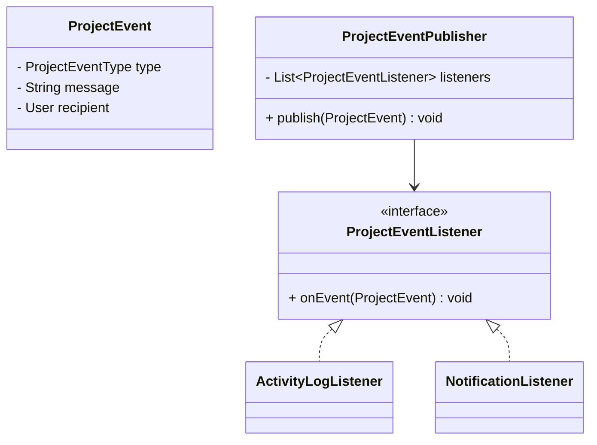
```mermaid
classDiagram
    class ProjectEvent {
      - ProjectEventType type
      - String message
      - User recipient
    }
    class ProjectEventPublisher {
      - List~ProjectEventListener~ listeners
      + publish(ProjectEvent) void
    }
    class ProjectEventListener {
      <<interface>>
      + onEvent(ProjectEvent) void
    }
    class ActivityLogListener
    class NotificationListener
    ProjectEventPublisher --> ProjectEventListener
    ProjectEventListener <|.. ActivityLogListener
    ProjectEventListener <|.. NotificationListener
```

### Code essentiel

```java
@Component
public class ProjectEventPublisher {
    private final List<ProjectEventListener> listeners;

    public ProjectEventPublisher(List<ProjectEventListener> listeners) {
        this.listeners = listeners;
    }

    public void publish(ProjectEvent event) {
        for (ProjectEventListener listener : listeners) {
            listener.onEvent(event);
        }
    }
}
```

Utilisation :

```java
eventPublisher.publish(new ProjectEvent(
    ProjectEventType.TASK_STATUS_CHANGED,
    task.getTitle() + " -> " + targetStatus,
    task.getAssignee()
));
```

---

## 9.2 Strategy - `AssignmentStrategy`

### Probleme

L'assignation automatique d'une tache peut suivre plusieurs algorithmes : charge de travail, round-robin, manuel, futur algorithme IA. Mettre toutes les conditions dans `TaskService` creerait un gros bloc `if/else`.

### Solution

Le pattern **Strategy** encapsule chaque algorithme dans une classe separee.

### Diagramme de classes

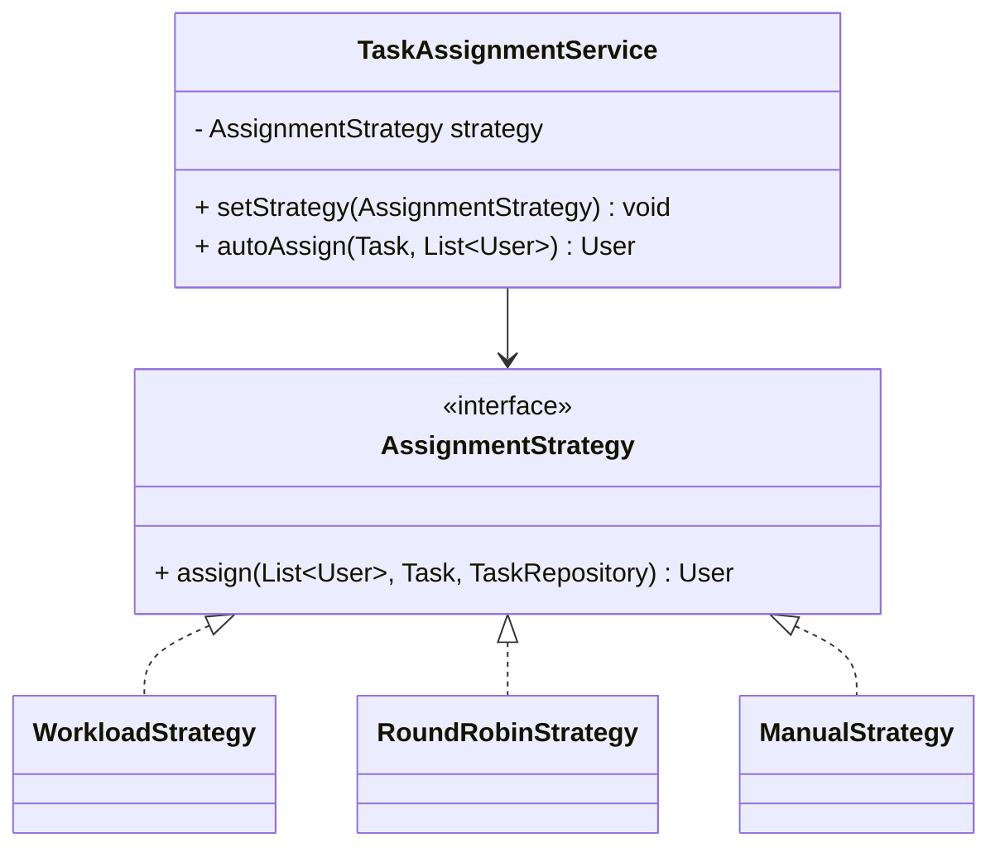
```mermaid
classDiagram
    class AssignmentStrategy {
      <<interface>>
      + assign(List~User~, Task, TaskRepository) User
    }
    class WorkloadStrategy
    class RoundRobinStrategy
    class ManualStrategy
    class TaskAssignmentService {
      - AssignmentStrategy strategy
      + setStrategy(AssignmentStrategy) void
      + autoAssign(Task, List~User~) User
    }
    AssignmentStrategy <|.. WorkloadStrategy
    AssignmentStrategy <|.. RoundRobinStrategy
    AssignmentStrategy <|.. ManualStrategy
    TaskAssignmentService --> AssignmentStrategy
```

### Code essentiel

```java
@Component
public class TaskAssignmentService {
    private AssignmentStrategy strategy;
    private final TaskRepository taskRepository;

    public TaskAssignmentService(TaskRepository taskRepository) {
        this.taskRepository = taskRepository;
        this.strategy = new WorkloadStrategy();
    }

    public void setStrategy(AssignmentStrategy strategy) {
        this.strategy = strategy;
    }

    public User autoAssign(Task task, List<User> members) {
        return strategy.assign(members, task, taskRepository);
    }
}
```

---
## 9.3 State - `TaskStateMachine`

### Probleme

Une tache ne peut pas passer n'importe comment d'un statut a un autre. Exemple :

```text
TODO -> IN_PROGRESS
IN_PROGRESS -> IN_REVIEW ou BLOCKED
BLOCKED -> IN_PROGRESS
IN_REVIEW -> DONE ou IN_PROGRESS
DONE -> aucun changement
```

Sans pattern State, les regles de transition seraient dispersees dans le service.

### Solution

Le pattern **State** donne a chaque statut sa propre classe qui sait vers quels statuts il peut evoluer.

### Diagramme de classes

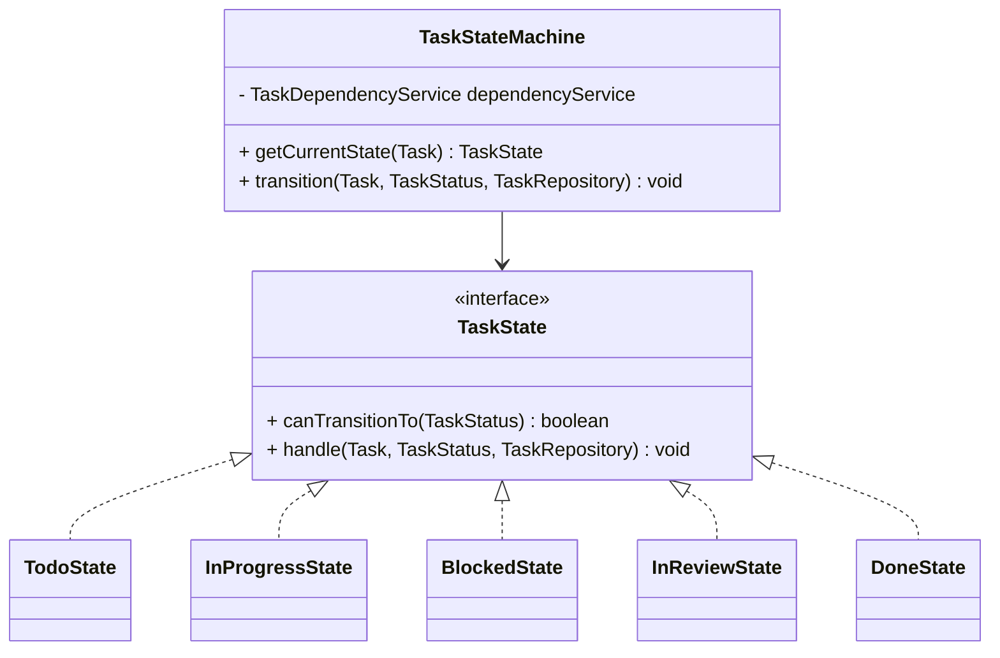
```mermaid
classDiagram
    class TaskState {
      <<interface>>
      + canTransitionTo(TaskStatus) boolean
      + handle(Task, TaskStatus, TaskRepository) void
    }
    class TodoState
    class InProgressState
    class BlockedState
    class InReviewState
    class DoneState
    class TaskStateMachine {
      - TaskDependencyService dependencyService
      + getCurrentState(Task) TaskState
      + transition(Task, TaskStatus, TaskRepository) void
    }
    TaskState <|.. TodoState
    TaskState <|.. InProgressState
    TaskState <|.. BlockedState
    TaskState <|.. InReviewState
    TaskState <|.. DoneState
    TaskStateMachine --> TaskState
```

### Code essentiel

```java
public void transition(Task task, TaskStatus target, TaskRepository repo) {
    TaskState currentState = getCurrentState(task);
    if (!currentState.canTransitionTo(target)) {
        throw new IllegalStateException(
            "Invalid transition: " + task.getStatus() + " -> " + target);
    }
    if (task.getStatus() == TaskStatus.TODO && target == TaskStatus.IN_PROGRESS
            && !dependencyService.canStart(task)) {
        throw new IllegalStateException(
            "Cannot start task: unfinished dependencies exist");
    }
    currentState.handle(task, target, repo);
}
```

### Probleme resolu dans TeamSync

Les transitions invalides sont bloquees automatiquement. Par exemple, `TODO -> DONE` est refuse car elle saute les etapes normales du workflow.

---

## 9.4 Command - Undoable Task Actions

### Probleme

Certaines actions sur les taches doivent pouvoir etre annulees : delete, assign, change status. Sans Command, chaque action devrait implementer son propre mecanisme d'annulation.

### Solution

Le pattern **Command** encapsule chaque action dans un objet avec `execute()` et `undo()`. Un invoker garde un historique par utilisateur.

### Diagramme de classes

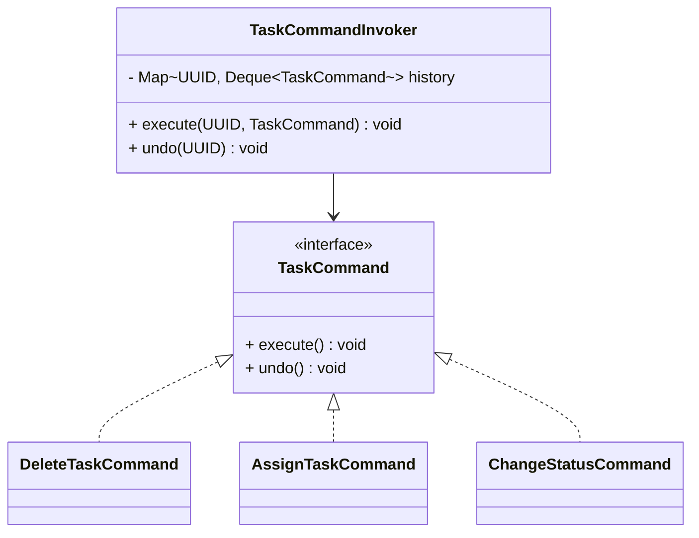
```mermaid
classDiagram
    class TaskCommand {
      <<interface>>
      + execute() void
      + undo() void
    }
    class DeleteTaskCommand
    class AssignTaskCommand
    class ChangeStatusCommand
    class TaskCommandInvoker {
      - Map~UUID, Deque~TaskCommand~~ history
      + execute(UUID, TaskCommand) void
      + undo(UUID) void
    }
    TaskCommand <|.. DeleteTaskCommand
    TaskCommand <|.. AssignTaskCommand
    TaskCommand <|.. ChangeStatusCommand
    TaskCommandInvoker --> TaskCommand
```

### Code essentiel

```java
@Component
public class TaskCommandInvoker {
    private static final int MAX_HISTORY = 10;
    private final Map<UUID, Deque<TaskCommand>> history = new HashMap<>();

    public void execute(UUID userId, TaskCommand command) {
        command.execute();
        Deque<TaskCommand> stack = history.computeIfAbsent(userId, id -> new ArrayDeque<>());
        stack.push(command);
        if (stack.size() > MAX_HISTORY) {
            ((ArrayDeque<TaskCommand>) stack).removeLast();
        }
    }

    public void undo(UUID userId) {
        Deque<TaskCommand> stack = history.get(userId);
        if (stack == null || stack.isEmpty()) {
            throw new IllegalStateException("No commands to undo for user: " + userId);
        }
        stack.pop().undo();
    }
}
```

Utilisation :

```java
public void delete(UUID id, UUID userId) {
    Task task = getTask(id);
    commandInvoker.execute(userId, new DeleteTaskCommand(task, taskRepository));
}
```

---

## 9.5 Chain of Responsibility - Task Validation

### Probleme

Avant de creer une tache, plusieurs validations doivent etre faites : titre obligatoire, deadline valide, assignee existant, priorite correcte. Mettre toutes les validations dans une seule methode creerait un code long et difficile a etendre.

### Solution

Le pattern **Chain of Responsibility** enchaine plusieurs validateurs. Chaque validateur traite sa responsabilite puis transmet au suivant.

### Diagramme de classes

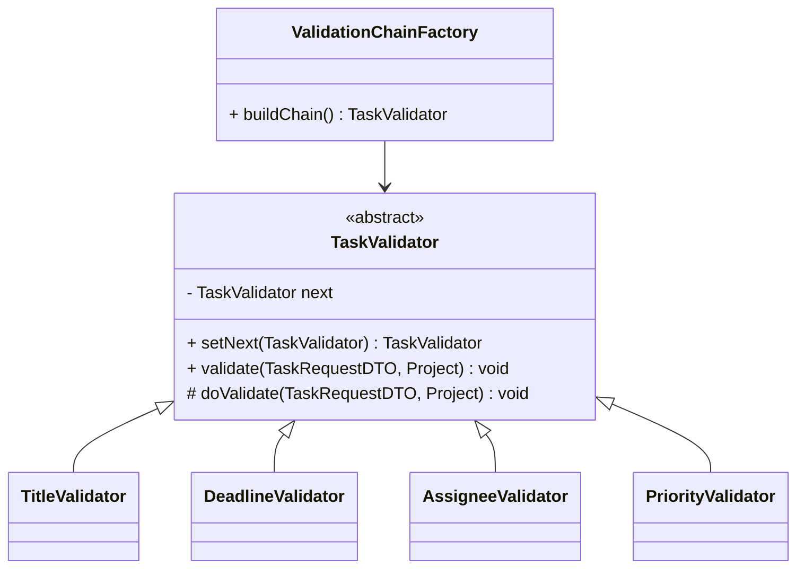
```mermaid
classDiagram
    class TaskValidator {
      <<abstract>>
      - TaskValidator next
      + setNext(TaskValidator) TaskValidator
      + validate(TaskRequestDTO, Project) void
      # doValidate(TaskRequestDTO, Project) void
    }
    class TitleValidator
    class DeadlineValidator
    class AssigneeValidator
    class PriorityValidator
    class ValidationChainFactory {
      + buildChain() TaskValidator
    }
    TaskValidator <|-- TitleValidator
    TaskValidator <|-- DeadlineValidator
    TaskValidator <|-- AssigneeValidator
    TaskValidator <|-- PriorityValidator
    ValidationChainFactory --> TaskValidator
```

### Code essentiel

```java
@Component
public class ValidationChainFactory {
    public TaskValidator buildChain() {
        TitleValidator title = new TitleValidator();
        DeadlineValidator deadline = new DeadlineValidator();
        AssigneeValidator assignee = new AssigneeValidator(userRepository);
        PriorityValidator priority = new PriorityValidator();

        title.setNext(deadline).setNext(assignee).setNext(priority);
        return title;
    }
}
```

Utilisation :

```java
Project project = projectService.getProject(projectId);
validationChainFactory.buildChain().validate(request, project);
```

---

## 9.6 Template Method - ReportGenerator

### Probleme

Tous les rapports suivent le meme processus : collecter les donnees, traiter les donnees, formatter la sortie. Mais le format final change : JSON, CSV ou PDF.

### Solution

Le pattern **Template Method** definit l'algorithme global dans une methode finale `generate()`. Les sous-classes implementent les etapes variables.

### Diagramme de classes

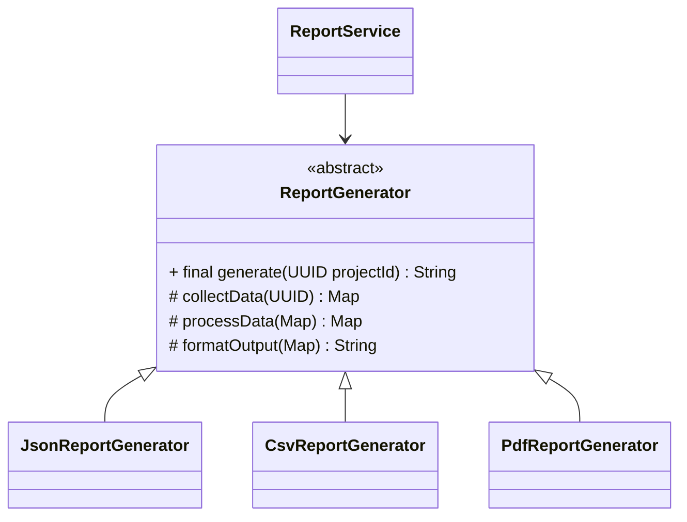
```mermaid
classDiagram
    class ReportGenerator {
      <<abstract>>
      + final generate(UUID projectId) String
      # collectData(UUID) Map
      # processData(Map) Map
      # formatOutput(Map) String
    }
    class JsonReportGenerator
    class CsvReportGenerator
    class PdfReportGenerator
    class ReportService
    ReportGenerator <|-- JsonReportGenerator
    ReportGenerator <|-- CsvReportGenerator
    ReportGenerator <|-- PdfReportGenerator
    ReportService --> ReportGenerator
```

### Code essentiel

```java
public abstract class ReportGenerator {
    public final String generate(UUID projectId) {
        Map<String, Object> data = collectData(projectId);
        Map<String, Object> processed = processData(data);
        return formatOutput(processed);
    }

    protected abstract Map<String, Object> collectData(UUID projectId);
    protected abstract Map<String, Object> processData(Map<String, Object> data);
    protected abstract String formatOutput(Map<String, Object> processed);
}
```

Utilisation :

```java
ReportGenerator generator = switch (normalizedFormat) {
    case "csv" -> csvGenerator;
    case "pdf" -> pdfGenerator;
    default -> jsonGenerator;
};

return generator.generate(projectId);
```

---

# 10. Synthese : patterns et problemes resolus

| Probleme logiciel | Pattern utilise | Effet dans TeamSync |
|---|---|---|
| Logger partage | Singleton | Une instance commune `AppLogger` |
| Creer plusieurs types de notifications | Factory Method | Creation in-app/email isolee |
| Construire des rapports complexes | Builder | API fluide et validation finale |
| Reutiliser des modeles de taches | Prototype | Clonage de templates |
| Simplifier l'initialisation projet | Facade | Un seul appel pour plusieurs services |
| Integrer un client email incompatible | Adapter | Interface interne stable `EmailService` |
| Controler acces aux actions taches | Proxy | Role/membership checks avant delegation |
| Ajouter urgent/email a notification | Decorator | Composition dynamique de comportements |
| Reagir a la creation/assignation/statut | Observer | Notifications/logs decouples du service |
| Choisir un algorithme d'assignation | Strategy | Workload ou round-robin interchangeable |
| Controler transitions des taches | State | Workflow de statut fiable |
| Annuler des actions taches | Command | Historique et undo par utilisateur |
| Valider une tache par etapes | Chain of Responsibility | Validateurs modulaires |
| Exporter plusieurs formats | Template Method | Workflow commun, format variable |

---

# 11. Qualite logicielle et principes SOLID

## 11.1 Single Responsibility Principle

Chaque pattern contribue a separer les responsabilites :

- `TitleValidator` valide seulement le titre.
- `DeadlineValidator` valide seulement la deadline.
- `TaskStateMachine` gere seulement les transitions.
- `ReportGenerator` gere seulement le processus d'export.

## 11.2 Open/Closed Principle

Le projet est extensible sans modification majeure :

- Ajouter une nouvelle strategie d'assignation : creer une classe qui implemente `AssignmentStrategy`.
- Ajouter un nouveau format de rapport : creer une sous-classe de `ReportGenerator`.
- Ajouter un nouveau listener d'evenement : implementer `ProjectEventListener`.
- Ajouter un nouveau canal de notification : creer une nouvelle factory/decorator.

## 11.3 Liskov Substitution Principle

Les sous-classes ou implementations peuvent remplacer leurs abstractions :

- `JsonReportGenerator`, `CsvReportGenerator`, `PdfReportGenerator` remplacent `ReportGenerator`.
- `WorkloadStrategy` et `RoundRobinStrategy` remplacent `AssignmentStrategy`.
- `InAppSender`, `EmailDecorator`, `UrgentDecorator` remplacent `NotificationSender`.

## 11.4 Interface Segregation Principle

Les interfaces restent petites :

- `CloneableTask` contient seulement `cloneTask()`.
- `EmailService` contient seulement `sendEmail()`.
- `TaskCommand` contient seulement `execute()` et `undo()`.

## 11.5 Dependency Inversion Principle

Les services dependent d'abstractions quand c'est pertinent :

- `NotificationService` utilise `EmailService` et non directement `MockExternalEmailClient`.
- Les strategies sont manipulees via `AssignmentStrategy`.
- Les notifications sont envoyees via `NotificationSender`.

---
# 12. Exemples de flux metier

## 12.1 Creation d'une tache

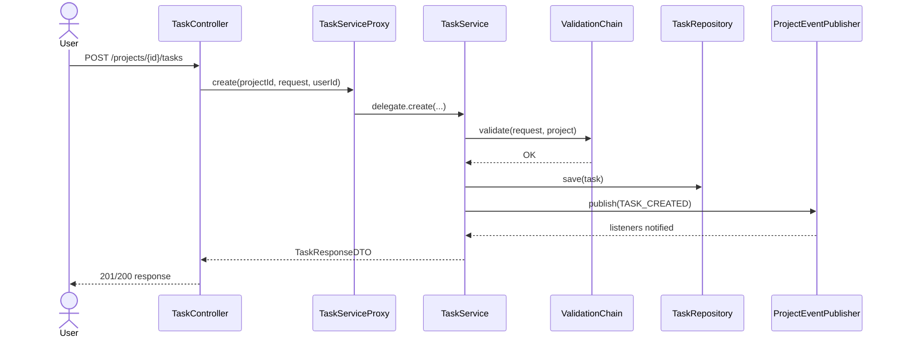
```mermaid
sequenceDiagram
    actor User
    participant Controller as TaskController
    participant Proxy as TaskServiceProxy
    participant Service as TaskService
    participant Chain as ValidationChain
    participant Repo as TaskRepository
    participant Observer as ProjectEventPublisher

    User->>Controller: POST /projects/{id}/tasks
    Controller->>Proxy: create(projectId, request, userId)
    Proxy->>Service: delegate.create(...)
    Service->>Chain: validate(request, project)
    Chain-->>Service: OK
    Service->>Repo: save(task)
    Service->>Observer: publish(TASK_CREATED)
    Observer-->>Service: listeners notified
    Service-->>Controller: TaskResponseDTO
    Controller-->>User: 201/200 response
```

Patterns impliques :

- Proxy : controle d'acces selon le contexte.
- Chain of Responsibility : validation de la requete.
- Observer : publication de l'evenement.
- Factory/Decorator eventuellement pour notification.

## 12.2 Changement de statut d'une tache

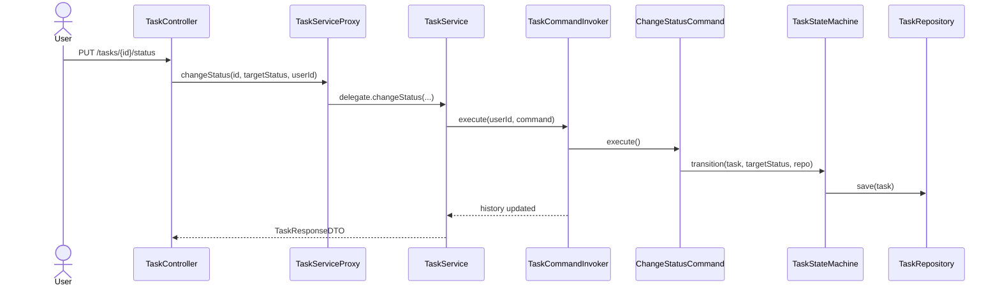
```mermaid
sequenceDiagram
    actor User
    participant Controller as TaskController
    participant Proxy as TaskServiceProxy
    participant Service as TaskService
    participant Invoker as TaskCommandInvoker
    participant Command as ChangeStatusCommand
    participant State as TaskStateMachine
    participant Repo as TaskRepository

    User->>Controller: PUT /tasks/{id}/status
    Controller->>Proxy: changeStatus(id, targetStatus, userId)
    Proxy->>Service: delegate.changeStatus(...)
    Service->>Invoker: execute(userId, command)
    Invoker->>Command: execute()
    Command->>State: transition(task, targetStatus, repo)
    State->>Repo: save(task)
    Invoker-->>Service: history updated
    Service-->>Controller: TaskResponseDTO
```

Patterns impliques :

- Command : action undoable.
- State : validation et application de transition.
- Observer : publication de l'evenement de changement.

## 12.3 Notification urgente

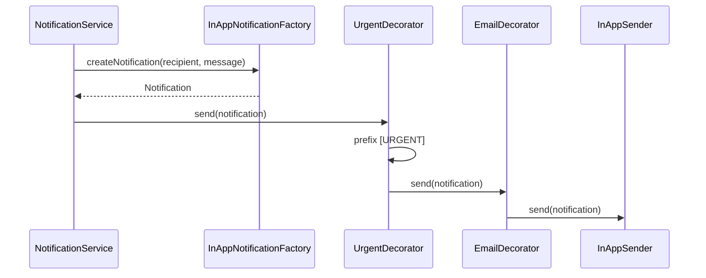
```mermaid
sequenceDiagram
    participant Service as NotificationService
    participant Factory as InAppNotificationFactory
    participant Decorator as UrgentDecorator
    participant Email as EmailDecorator
    participant Sender as InAppSender

    Service->>Factory: createNotification(recipient, message)
    Factory-->>Service: Notification
    Service->>Decorator: send(notification)
    Decorator->>Decorator: prefix [URGENT]
    Decorator->>Email: send(notification)
    Email->>Sender: send(notification)
```

Patterns impliques :

- Factory Method : creation notification.
- Decorator : enrichissement urgent/email.
- Adapter : envoi email via interface interne.

---

# 13. Analyse critique

## Points forts

- Les patterns sont bien separes dans des packages dedies.
- Les patterns sont relies a de vrais cas metier.
- Le catalogue `/patterns` facilite la presentation academique.
- Les controllers restent relativement simples.
- Le backend respecte une structure classique Spring Boot propre.
- Le frontend utilise des services API au lieu de requetes brutes dans les composants.

## Points ameliorables

- `AppLogger` utilise `System.out.println`; en production il faudrait utiliser SLF4J/Logback.
- Certains patterns sont pedagogiques et pourraient etre remplaces par des mecanismes Spring dans un systeme industriel.
- Le `TaskCommandInvoker` garde l'historique en memoire; en production, il faudrait eventuellement persister l'historique.
- Les notifications email sont simulees par `MockExternalEmailClient`.
- Le frontend a encore un warning de budget CSS sur la page workspace-list.

---

# 14. Code complet et packages importants

## 14.1 Backend core

```text
src/main/java/com/teamsync/
├── presentation/controller
├── presentation/dto
├── service
├── repository
├── domain/entity
├── domain/enums
├── infrastructure/security
└── patterns
```

## 14.2 Packages de patterns

```text
patterns
├── creational
│   ├── singleton/AppLogger.java
│   ├── factory/NotificationFactory.java
│   ├── builder/ReportBuilder.java
│   └── prototype/CloneableTask.java
├── structural
│   ├── facade/ProjectManagementFacade.java
│   ├── adapter/EmailServiceAdapter.java
│   ├── proxy/TaskServiceProxy.java
│   └── decorator/UrgentDecorator.java
└── behavioral
    ├── observer/ProjectEventPublisher.java
    ├── strategy/TaskAssignmentService.java
    ├── state/TaskStateMachine.java
    ├── command/TaskCommandInvoker.java
    ├── chain/ValidationChainFactory.java
    └── template/ReportGenerator.java
```

## 14.3 Endpoint catalogue academique

Le projet expose un endpoint public qui donne la liste des patterns :

```http
GET /patterns
```

Dans `PatternsController`, chaque pattern est documente avec :

- son nom ;
- sa categorie ;
- son package ;
- ses classes principales ;
- son objectif.

Cette page est importante pour la presentation, car elle montre que les patterns ne sont pas caches dans le code : ils sont explicitement repertories.

---

# 15. Endpoints importants

| Endpoint | Role |
|---|---|
| `POST /auth/register` | Creation de compte |
| `POST /auth/login` | Authentification JWT |
| `GET /users/me` | Profil courant |
| `GET /workspaces` | Workspaces visibles |
| `POST /workspaces` | Creation workspace |
| `GET /projects` | Recherche projets |
| `POST /workspaces/{id}/projects` | Creation projet |
| `POST /projects/initialize` | Initialisation via Facade |
| `GET /tasks` | Liste paginee des taches |
| `PUT /tasks/{id}/status` | Changement de statut via State/Command |
| `PUT /tasks/{id}/assign` | Assignation via Command/Proxy |
| `GET /patterns` | Catalogue des design patterns |
| `GET /reports/projects/{id}?format=json|csv|pdf` | Export via Template Method |

---

# 16. Resume pour les slides

## Slide : pourquoi les patterns ?

- Eviter le code spaghetti.
- Centraliser les regles metier.
- Decoupler les modules.
- Rendre le systeme extensible.
- Faciliter les tests et la maintenance.

## Slide : patterns les plus importants dans TeamSync

- **State** : workflow des taches.
- **Command** : undo des actions.
- **Observer** : evenements metier.
- **Strategy** : assignation automatique.
- **Chain of Responsibility** : validation modulaire.
- **Template Method** : generation de rapports.

## Slide : exemple de narration

Un bon scenario de presentation consiste a montrer la creation d'une tache puis son changement de statut :

```text
Creation tache
-> Validation Chain
-> Save repository
-> Observer event
-> Notification Factory/Decorator
-> Changement status
-> Command
-> State Machine
-> Undo possible
```

Ce scenario montre plusieurs patterns en interaction dans un seul flux metier.

---

# 17. Conclusion

TeamSync est un projet interessant pour une presentation de genie logiciel car il montre comment une application full-stack peut appliquer plusieurs concepts importants :

- architecture en couches ;
- REST API ;
- securite JWT ;
- persistence relationnelle ;
- DTOs ;
- separation des responsabilites ;
- design patterns GoF ;
- frontend Angular moderne.

Le point central du projet est l'utilisation des **14 design patterns GoF** dans des scenarios concrets : validation, notification, assignation, workflow de taches, export de rapports, protection d'operations sensibles, initialisation de projet, etc.

La valeur pedagogique du projet vient du fait que les patterns ne sont pas seulement des exemples isoles. Ils sont connectes a la logique metier de TeamSync :

- le **State** protege le cycle de vie des taches ;
- le **Command** rend certaines actions annulables ;
- le **Observer** decouple les reactions aux evenements ;
- le **Strategy** rend l'assignation flexible ;
- le **Chain of Responsibility** rend la validation extensible ;
- le **Template Method** standardise les exports ;
- les patterns de creation et structurels simplifient la construction, l'integration et la composition.

En conclusion, TeamSync montre que les design patterns sont utiles lorsqu'ils repondent a un vrai probleme de conception. Ils ameliorent la clarte, l'extensibilite, la maintenabilite et la qualite globale du systeme.
